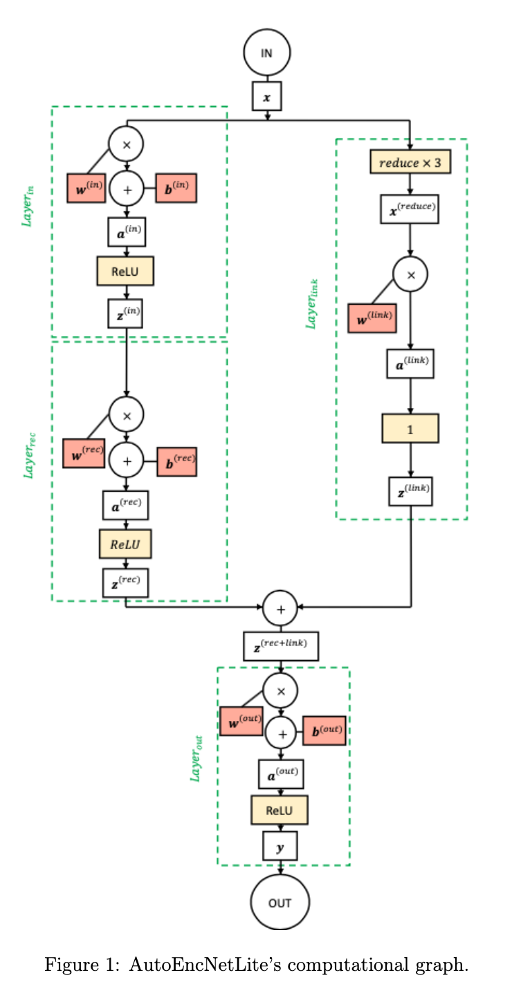
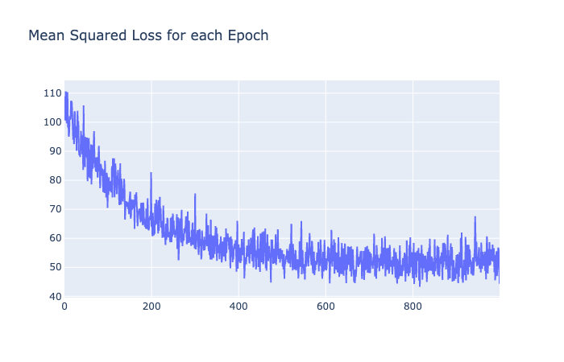

# AutoEncNet
AutoEncNet training Autoencoder Neural Net Realization from scratch in Python

## Intro

In this realization we explore the possibilities of training the following Autoencoder Neural Network. 
The courtesy goes to UCU Intro to Deep Learning Course and Artem Chernodub, PhD.

#### AutoEncNet Computational Graph

## Code Files structure

The realization is Split between several files:

**utils.py** - contains some useful functions to perform during network training

**train_autoenc_lite.py** - contains the class and methods for Neural Network Training and Run

**VectorVsScalarForward.py** - contains the test run to check the Forward layer calculation sped comparison of Vactor and Scalar realizations

**images_train.pickle** - train data, 1000 greyscale images of size (15,15)

**images_test.pickle** - test data, 20 greyscale images of size (15,15)

## Methods Realization

#### Initialization

The initialization of weights is performed with Xavier uniform distribution.

`
def init_uniform(W):`

    n, m = W.shape[0], W.shape[1]
    normFactor = np.sqrt(6)/np.sqrt(n+m)
    weightArray = np.random.uniform(-normFactor, normFactor, n*m)

    return weightArray.reshape(n,m)
`

The W_rec matrix is initialized as Diagonal Matrix with size P and is non-trainable

`self.w_rec = np.eye(P)`

The bias vectors are initialized with Zeros

`self.b_in = np.zeros((1, P))`
        
`self.b_out = np.zeros((1, D))`

`self.b_rec = np.zeros((1, P))`

#### Vector vs Scalar Form for the Forward pass

We run the Network on the Layer_in to get a feeling how Scalar Realization differs from the Vector one.

In our example we got the following numbers:

The Scalar Form  takes 0.1991 seconds
The Vector Form  takes 0.0004 seconds
The Vector Form performs 475.6281 times faster the Scalar one

#### Forward pass

The forward pass for respective layers are implemented in the following methods of EncDecNetLite Class

`def inLayerForward(self, x)`

`def recLayerForward(self):`

`def linkLayerForward(self, x):`

`def outLayerForward(self):`

#### Backward pass

The backward pass for respective layers are implemented in the following methods of EncDecNetLite Class

`def outLayerBackward(self, x):`

`def linkLayerBackward(self):`

`def recLayerBackward(self):`

`def inLayerBackward(self, x):`

The derivatives are stored in Class attributes
After they are calculated the Weights are updated with the following method

`def apply_dw(self):`

    `self.w_in = self.w_in - LEARNING_RATE * self.dL_dWin`
    
    `self.b_in = self.b_in - LEARNING_RATE * self.dL_dBin`  
    
    `self.w_link = self.w_link - LEARNING_RATE * self.dL_dWlink`  
    
    `self.w_out = self.w_out - LEARNING_RATE * self.dL_dWout`
    
    `self.b_out = self.b_out - LEARNING_RATE * self.dL_dBout`
    
## Training and results

#### Training hyperparameters

The following parameters were used

`BATCH_SIZE = 20`

`UPDATES_NUM = 1000`

`IMG_SIZE = 15`

`D = 225`

`P = 75`

`LEARNING_RATE = 0.0001`

#### Training Loss results

The following Loss progress was achieved during training

#### Generated Test Images vs the True ones

Here are the couple of examples of images.
The rest of the images could be seen in an Images/Test_Images or Images/Predicted_Images folder

##### TestTrue1

##### TestPredicted1

##### TestTrue2

##### TestPredicted2

##### TestTrue20

##### TestPredicted20

As we see the prediction is not perfect and further Network improvements should be considered like regularization, data augmentation, hyperparameters tuning or Architecture complexing.

